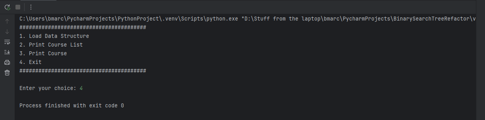
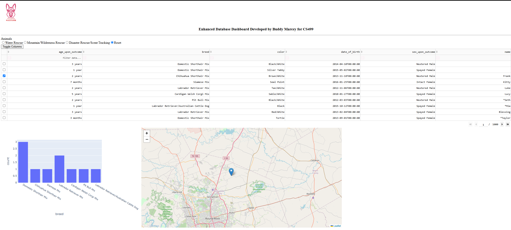

# Buddy Marcey 

# Computer Science Capstone

### An Introduction and Self-Assessment

My computer science journey began in earnest in the summer of 2021, when I decided to return to school. I earned an Associate of Science degree in General Studies with a Concentration in Biology in 2022. I then chose to complete my Bachelor of Science degree in Computer Science with a Concentration in Information Security at Southern New Hampshire University. I enjoy data science, and I learned along the way that what I enjoy is presenting that data to an end user; I want to focus on data presentation more than I want to gather and collate the data myself. I found that I enjoy almost every part of computer science, and I would like to eventually work in Systems Architecture or DevOps; either of which requires expertise in several categories of computer science to excel. 

Throughout the many courses in my program, I learned about many different aspects of computer science. In Introduction to Scripting, Foundations in Application Development, and Programming Languages, I learned how basic syntax works in various programming languages and how some core principles work. In Operating Platforms, Software Development Lifecycle, and System Analysis and Design, I learned how software development team members work in a collaborative environment to meet the needs of the stakeholders or end users. In Data Structures and Algorithms, Applied Linear Algebra, and Discrete Mathematics, I learned many logic principles, and how logic can be applied to solve problems efficiently. In Software Security, Computer Systems Security, and Cybersecurity Foundations, I learned about data privacy, how to effectively secure access to data, and how to write secure code. Finally, in Client/Server Development, Software Test and Automation, and Full Stack Development, I learned to follow established design patterns to produce applications that work properly and allow the end user to access required data without being a data expert. These courses taught me a lot about programming, system design, logic, and many other skills that I will need to succeed in my future career.

The goal of this project is to showcase my computer science skills by enhancing some of the work done in previous courses. These projects focus on the following core components:

> Software Design and Engineering

> Algorithms and Data Structures

> Databases

The enhancement of the artifacts I have chosen will show proficiency in computer science by fulfilling the following course objectives:

1. Employ strategies for building collaborative environments that enable diverse audiences to support organizational decision-making in the field of computer science.
2. Design, develop, and deliver professional-quality oral, written, and visual communications that are coherent, technically sound, and appropriately adapted to specific audiences and contexts.
3. Design and evaluate computing solutions that solve a given problem using algorithmic principles and computer science practices and standards appropriate to its solution, while managing the trade-offs involved in design choices.
4. Demonstrate an ability to use well-founded and innovative techniques, skills, and tools in computing practices for the purpose of implementing computer solutions that deliver value and accomplish industry-specific goals.
5. Develop a security mindset that anticipates adversarial exploits in software architecture and designs to expose potential vulnerabilities, mitigate design flaws, and ensure privacy and enhanced security of data and resources.

The narratives that accompany the artifact enhancements will discuss how the enhancements fulfill these outcomes.

The artifacts will be presented in their original submission form with a brief description of what they are and what they are trying to accomplish. Then I will discuss how the artifact was enhanced and how that enhancement ties into the core components and course objectives.

Click this button to see my video code review and enhancement plan on YouTube:

<button onclick="window.location.href='https://youtu.be/WTK707jGXt0?si=WSmDPDXzF01QVFbW';">Code Review</button>

## Artifact 1: CSV Parser with Binary Search Tree

**Brief Description** The goal of this project was to make a .csv file parser that would read in college courses from a predefined data set and store the courses in a data structure for easy look-up.

Here is a link to the [original project repository](https://github.com/VandalEvil/CapstoneProject/blob/main/DataStructuresAndAlgorithms-main/DataStructuresAndAlgorithms-main/ProjectTwo.cpp) and a [description](https://github.com/VandalEvil/CapstoneProject/blob/main/CSVParserDescription.md).

**Notable Details** The original project worked because the instructor for the course gave us a sufficiently randomized data set. The program would not work with sorted data because the tree it generated would only have one branch, effectively turning the binary search tree into a linked list. The original project was also written in C++. 

**Enhancement** I translated the code from C++ to Python to make it more adaptable to modern data science tools; Python is more widely used for data science than C++, and future enhancements might want to take advantage of preexisting libraries or tools. I converted the binary search tree to a self-balancing Red-Black tree so that it can be used with both sorted and unsorted datasets. A more detailed assessment can be found [at this link](https://github.com/VandalEvil/CapstoneProject/blob/main/DataStructuresAndAlgorithmsNarrative.pdf).

Here is a link to the [enhanced project repository](https://github.com/VandalEvil/CapstoneProject/blob/main/CSVParserEnhanced/redblack.py).

## Artifact 2: Database with Plotly Dash Dashboard

**Brief Description** The goal of this project was to make a dashboard for end users that would take data from a database and display it in a user-friendly fashion.

Here is a link to the [original project repository](https://github.com/VandalEvil/CapstoneProject/blob/main/ClientServerDatabaseOriginal-main/cs340ClientServer-main/ProjectTwoDashboard.ipynb) and a [description](https://github.com/VandalEvil/CapstoneProject/blob/main/DataDashboardDescription.md).

**Notable Details** The original project only worked in the local virtual machine environment I developed it in. The original dash table looked messy since none of the data was obscured. The original used a pie chart instead of a histogram.

**Enhancement** The first part of the enhancement was to make the data set available from anywhere. I set up an EC2 instance on Amazon Web Services with Ubuntu Linux. I installed MongoDB and set up the service to make the data available to a remote link. I reconfigured the middleware to connect to this service and pull the database into a Pandas dataframe. I reconfigured the Plotly Dash components to not use Jupyter Notebook, since that method is deprecated, reconfigured it to use the new built-in Flask implementation, reworked the pie chart into a histogram so that it can be more easily read at a glance, and obscured some of the extraneous information from the data table; the end user does not need to see columns for latitude and longitude, for instance, but the data is still required for the map to function. A more detailed narrative about the build and process can be found [at this link](https://github.com/VandalEvil/CapstoneProject/blob/main/DashboardNarrativeOne.pdf) and [at this link](https://github.com/VandalEvil/CapstoneProject/blob/main/DashboardNarrativeTwo.pdf); there are two accompanying narratives because the enhancement of this artifact covers both databases and software design.

Here is the link to the [enhanced project repository](https://github.com/VandalEvil/CapstoneProject/blob/main/DatabaseDashboardEnhanced/refactoredDashboard.py).

## Summary

The enhancements to the artifacts and the accompanying narratives demonstrate the abilities I have acquired in the Computer Science program. A justification of the course outcomes can be found [here]().

